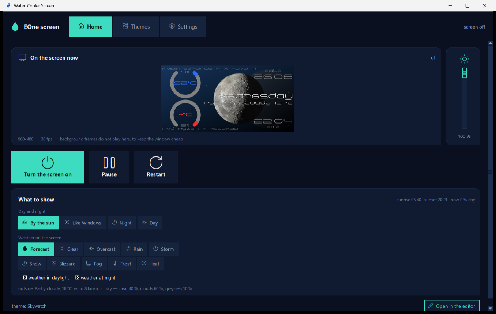
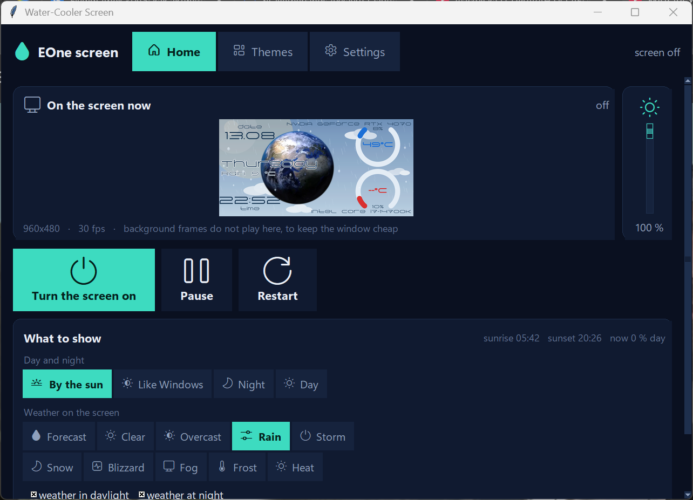
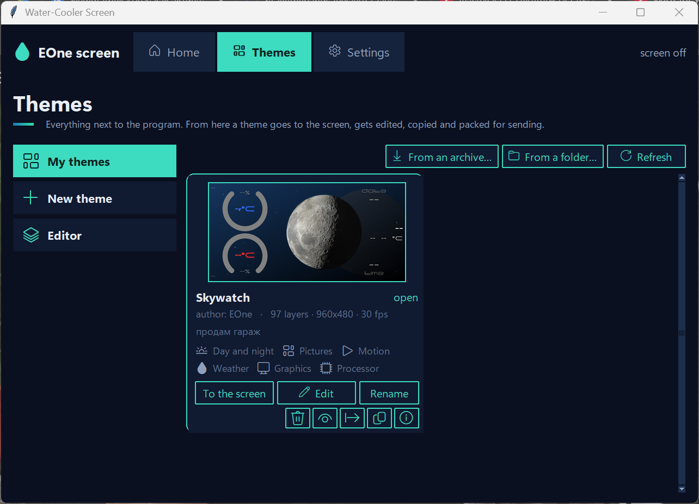
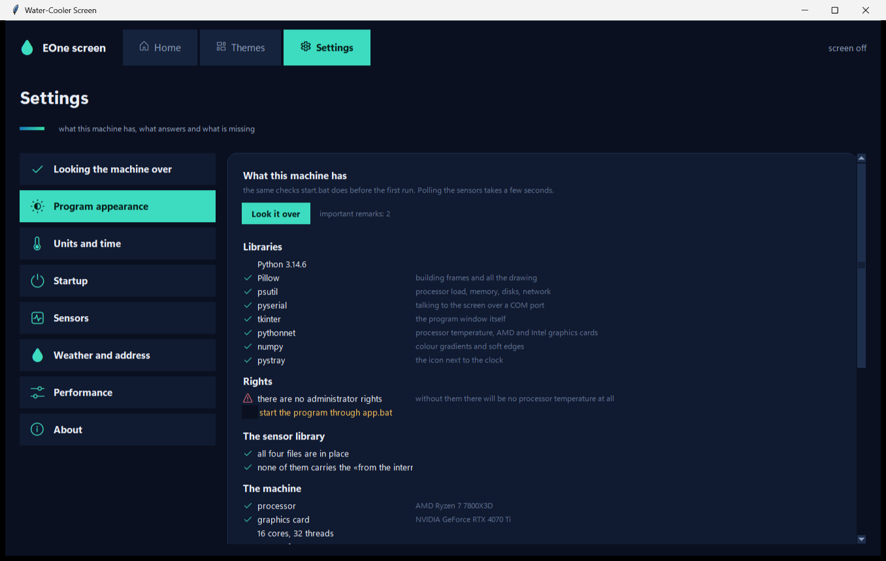
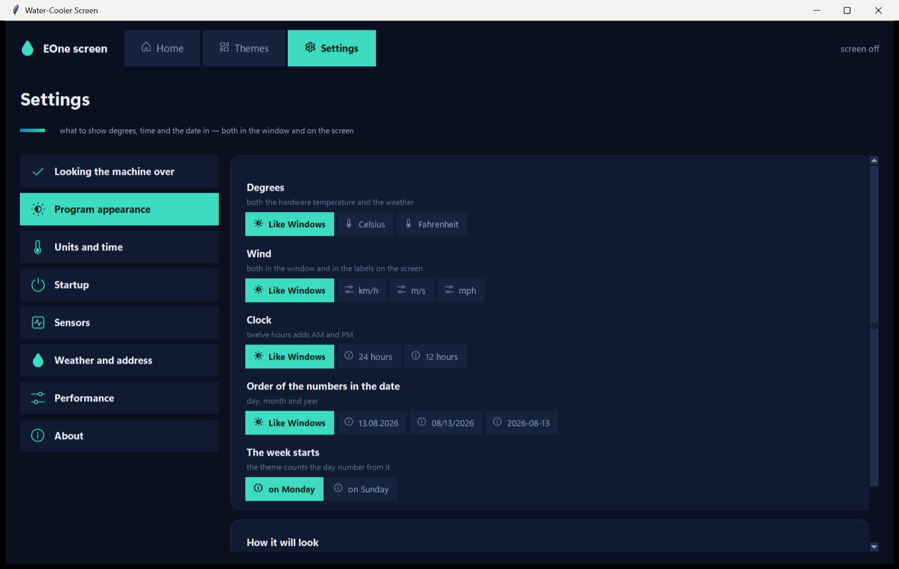
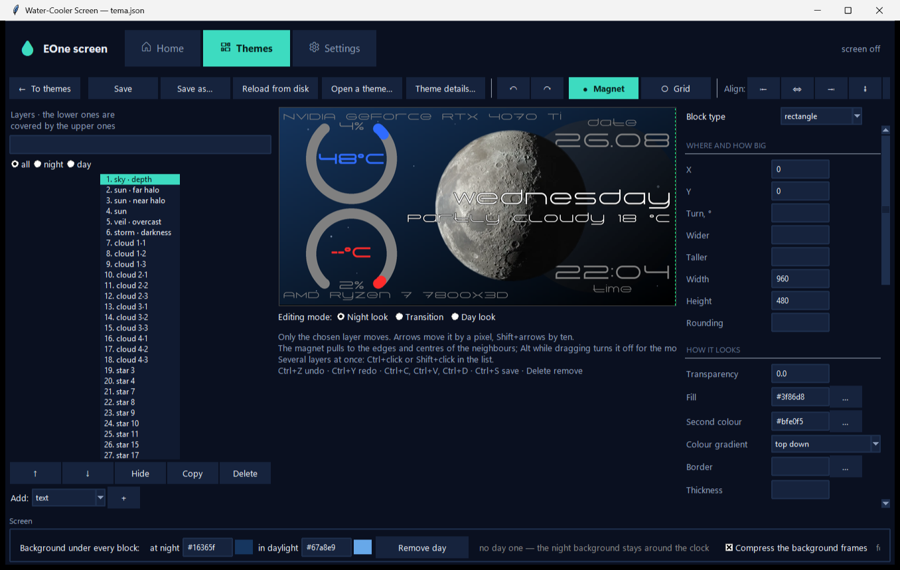

**Русский** · [English](README.md)

# EOne screen

Открытая замена штатной программе для экрана водянки **Jungle Leopard Pro Flow 360**
(контроллер TXW818, панель ST7701S, 960×480, по COM-порту).

Программа рисует панель мониторинга по описанию из JSON и гонит её на экран
кадрами JPEG. Плюс окно, в котором всё это настраивается: витрина тем,
редактор слоёв, датчики, погода.



Снимки сделаны с английским окном: язык переключается в настройках.

---

## Что она умеет

**Показывает железо.** Загрузка и температура процессора и видеокарты, память,
диски, сеть, время работы. Nvidia читается через `nvidia-smi`, AMD и Intel —
через LibreHardwareMonitor.

**Показывает погоду.** Пять готовых служб плюс возможность подключить любую
свою. Небо на панели меняется само: дождь, снег, метель, туман, гроза, мороз,
зной. День и ночь перетекают друг в друга по настоящему восходу и закату
в твоём городе.

**Даёт всё это переставить.** Редактор слоёв с холстом, привязками, отменой
и буфером обмена — темой можно поделиться архивом или одним слоем через
буфер.

**Не ест процессор.** Тема из 97 слоёв идёт 30 кадров в секунду и стоит около
половины процента процессора. Как это устроено — в конце README.

| | |
|---|---|
|  |  |
|  |  |

---

## Установка

Нужна **Windows** и **Python 3.9 или новее** ([python.org](https://www.python.org/downloads/),
при установке отметить «Add python.exe to PATH»).

```
pip install pillow psutil pyserial pythonnet numpy pystray
```

Обязательны первые три и `tkinter` (идёт с Python). Остальные — по желанию:
без `pythonnet` не будет температуры процессора, без `pystray` — значка
рядом с часами, без `numpy` мягкие переходы цвета считаются медленнее.

Дальше просто запустить:

```
app.bat
```

Он спросит у Windows права администратора и откроет окно. При первом
запуске программа сама осматривает машину — какие датчики отвечают,
виден ли экран на COM-порту, есть ли интернет и отвечает ли погода, —
и говорит, чего не хватает и что с этим делать. Та же страница живёт
в настройках, раздел **Осмотр машины**, и открыть её можно когда угодно.

Права нужны ровно для одного — температуры процессора: Windows не даёт
обычным программам читать регистры процессора. Всё остальное работает
и без них.

**Дальше — с ярлыка.** В настройках, раздел **Запуск**, поставьте
галочку «Ярлык на рабочем столе»: программа сделает ярлык со своим
значком, и он запускает её так же, с правами. После этого ни папка,
ни командная строка больше не нужны.

### Когда нужен `start.bat`

Только для одного, чего окно сделать не может: Windows помечает файлы,
скачанные из интернета, и пока эта пометка на `.dll`, .NET отказывается
загружать библиотеку датчиков. `start.bat` снимает пометку и заодно
делает тот же осмотр в консоли.

Если осмотр машины пишет, что библиотека «помечена как скачанная
из интернета» — запустите `start.bat` один раз. В остальных случаях
он не нужен вовсе.

---

## Как этим пользоваться

### Первый запуск

Программа сама осматривает машину и показывает, что нашла: библиотеки,
права, файлы библиотеки датчиков, железо, датчики, экран на порту,
погоду. Рядом с каждой бедой написано, что делать, а где хватает
нажатия — стоит кнопка.

Окно устроено просто: три раздела наверху.

### Главная

Здесь видно то же, что уходит на экран водянки, только без анимации —
окно нарочно не тратит на неё ничего.

| | |
|---|---|
| **Включить экран** | начать или прекратить вывод |
| **Пауза** | придержать, не закрывая порт |
| **Перезапустить** | заново открыть порт, если картинка сбилась |
| ползунок справа | яркость подсветки |

Ниже — **Что показывать**. Два ряда, и они про разное:

* **День и ночь** — когда на экране дневной вид, а когда ночной.
  «По солнцу» берёт настоящие восход и закат в вашем городе.
* **Погода на экране** — можно посмотреть, как тема ведёт себя в грозу
  или метель, не дожидаясь их. Настоящий прогноз при этом никуда
  не девается, «По прогнозу» возвращает всё назад.

Если тема не умеет ни дня с ночью, ни погоды, этот блок не показывается
вовсе.

### Темы

Витрина всего, что лежит рядом с программой. На карточке темы:

| | |
|---|---|
| **На экран** | сделать эту тему текущей |
| **Изменить** | открыть в редакторе |
| **Переименовать** | папка на диске переименуется вместе с темой |
| значки справа | описание, копия, упаковать в архив, картинка для показа, убрать |

Тему можно целиком переслать другому человеку: «упаковать» кладёт
в один архив всё, на что она ссылается. Обратно — кнопкой «Из архива…».

### Редактор

Слева список слоёв, в середине точный предпросмотр того, что уйдёт
на экран, справа свойства выбранного слоя.

* двигать — мышкой, стрелками (Shift — на десять точек) или полями X и Y;
* магнит притягивает к краям и центрам соседей, Alt его временно отключает;
* несколько слоёв разом — Ctrl+щелчок или Shift+щелчок в списке;
* Ctrl+Z отменить, Ctrl+C и Ctrl+V копировать и вставить — в том числе
  в другую тему или другому человеку сообщением;
* наверху переключатель **ночь / переход / день**: правки уходят именно
  в тот вид, который выбран.



Все поля темы правятся здесь же, а что делает каждое — написано
в подсказке при наведении.

### Настройки

| раздел | что там |
|---|---|
| **Оформление программы** | светлое или тёмное окно, язык |
| **Единицы и время** | °C или °F, км/ч, м/с или мили, 12 или 24 часа, порядок чисел в дате, начало недели |
| **Запуск** | ярлык на рабочем столе, запуск вместе с Windows, сворачивание в трей |
| **Датчики** | что опрашивать и что из этого читается прямо сейчас |
| **Погода и адрес** | город, служба прогноза, свой источник |
| **Производительность** | частота, качество, сглаживание, сборка кадра в потоках |

Настройки частоты, качества и сглаживания действуют **сразу**,
перезапускать ничего не надо.

---

## Библиотека датчиков

Для температур нужны **ровно четыре файла** из архива
[LibreHardwareMonitor](https://github.com/LibreHardwareMonitor/LibreHardwareMonitor/releases),
положенные рядом с программой:

```
LibreHardwareMonitorLib.dll
HidSharp.dll
System.Memory.dll
System.Runtime.CompilerServices.Unsafe.dll
```

Остальные два десятка сборок из архива — от окна самой LibreHardwareMonitor.
Проверено перебором: с четырьмя файлами находится ровно столько же датчиков
(118), сколько со всеми двадцатью пятью.

Тем, у кого видеокарта **не Nvidia**, нужен ещё пятый файл —
`System.Numerics.Vectors.dll`: без него библиотека не открывает раздел
видеокарт.

---

## Погода

| служба | ключ | примечание |
|---|---|---|
| Open-Meteo | не нужен | по умолчанию, даёт и восход с закатом |
| met.no | не нужен | норвежский метеорологический институт |
| wttr.in | не нужен | ближе всех к тому, что показывает виджет Windows |
| OpenWeatherMap | нужен | ключ выдают при регистрации |
| WeatherAPI | нужен | то же самое |
| свой источник | как выйдет | адрес свой, поля указываются мышкой |

Про «как в Windows» честно: виджет Windows берёт погоду из MSN Weather,
а тот открытого доступа не даёт — отвечает отказом без ключа, зашитого
в саму систему. Подставлять чужой ключ в открытую программу неправильно.
Разница между службами — один-два градуса.

Свою службу подключают так: вписать адрес (в нём можно писать `{lat}`,
`{lon}` и `{key}`), нажать «Спросить службу» — программа спросит её один раз
и разложит ответ на пути, — и выбрать из списков, где лежит температура,
где ветер, где восход. Читать чужой JSON руками не нужно.

---

## Язык

Русский и английский, переключается в настройках, применяется при следующем
запуске. Ключ словаря — сама русская строка, поэтому непереведённое просто
остаётся русским и ничего не ломает.

---

## Как это устроено

```
panel.py     сборка кадра из слоёв, кэширование, вывод на экран
sensors.py   опрос железа и погоды в фоновых потоках
txw818.py    протокол экрана: порт, команды, отправка JPEG
edinicy.py   градусы, часы, дата, начало недели

app.py       окно: три раздела наверху, переключение страниц, трей
home.py      главная: зеркало экрана, вкл/выкл, яркость, день/ночь, погода
pages.py     темы и настройки
editor.py    редактор слоёв: холст, свойства, отмена, буфер, магнит
look.py      оформление окна: палитры, шрифты, значки, карточки
themes.py    поиск тем, метаданные, превью, копия, обмен архивом
prefs.py     настройки программы, автозапуск, ярлык
papka.py     где лежит программа
yazyk.py     русский и английский
start.py     осмотр машины перед первым запуском
```

Записки о движке — в [УСТРОЙСТВО.md](УСТРОЙСТВО.md).

Полное описание всех полей темы — в файле

### Почему это быстро

Слои разбиты на **отрезки**, и у каждого свой отпечаток. Пока отпечаток
не меняется, отрезок берётся из памяти. В отпечаток входит только то, что
на этом отрезке видно: часы без секунд перерисовываются раз в минуту,
а не тридцать раз в секунду.

Числа сравниваются с той точностью, с какой они видны. `{cpu_load:.0f}`
сравнивается по целым.

Кадры фона разбираются один раз и лежат сжатыми zlib; разобранное
складывается в `.кадры/` внутри темы, поэтому первый запуск занимает
несколько секунд, а следующие — доли секунды. Пустые кадры не хранятся
и не накладываются вовсе.

Замерено на теме «Skywatch», 97 слоёв, 30 кадр/с, сглаживание 2:

| | |
|---|---|
| ночь, переход, день | 30.0 кадр/с везде |
| спокойный кадр | 6.7 мс ночью, 9.2 днём при бюджете 33 |
| нагрузка | 16 % одного потока = 0.5 % процессора |
| память | 369 МБ, из них 276 — кадры фона |

---

## Лицензия

[CC BY-NC-SA 4.0](LICENSE) — пользоваться, переделывать и раздавать можно,
зарабатывать нельзя, переделанное раздавать на тех же условиях с указанием
автора.

Библиотека LibreHardwareMonitor принадлежит своим авторам и распространяется
по своей лицензии — MPL 2.0.

Автор — **EOne**.
